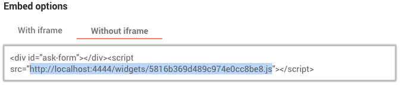

## Coral Ask Election Reactions

A prototype application to visualize reactions to the outcome of the 2016 election.

## Installation

Copy the file `config.sample.json` in the project root to `config.json`, then set the values of each key to match your deployment.

### Quick Start

To get started quickly with local development, just save this JSON as `config.json` in the project root:

```json
{
  "jsonURI": "http://localhost:3000/data/",
  "formId": "5816b369d489c974e0cc8be8",
  "formScript": "http://localhost:3000/data/5816b369d489c974e0cc8be8.js",
  "googleSheetId": "18yAMk_ydGpPLHTZPrLox7oplvgc-4aswu1arO_IHY9I"
}
```

### Configuration Guide

**jsonURI**:

This field holds the URI at which the JSON files output by Ask can be located over HTTP. For local development this will likely be "http://localhost:3000/data/", but in production it will usually be a URL to the location on Amazon S3 to which Ask uploads its JSON.

**formId**:

If you have a local instance of [Coral Ask](https://coralproject.net/products/ask.html) running at, say, localhost:2020, when you're editing the form you wish to use to drive this visualization you will be at a URL similar to this:
```
http://localhost:2020/forms/5816b369d489c974e0cc8be8
```
"5816b369d489c974e0cc8be8" is your formId. This ID is combined with the `jsonURI` to locate the JSON data files that will be loaded.

**formScript**:

This is the URL to the JS file that Ask provides to embed the script _without_ using an iframe. (An iframe cannot be used here because it does not provide any flexibility around style and display, and does not communciate the height of the form.) To get the URL of this script, in the Ask form editor go to "Publish Options," then select "Without iframe" in Embed Options and copy the `src` attribute of the script tag from the embed code:



This src attribute should be pasted into `config.json` as the `formScript` value. Don't worry about the `<div id="ask-form"></div>`, this app creates that for you.

**googleSheetId**:

Editorial text fields in this visualization and the non-user-editable text of the "letter to the president" that is assembled from the responses is managed through [Google Sheets](https://sheets.google.com): create a publicly-visible spreadsheet document by duplicating [this sheet](https://docs.google.com/spreadsheets/d/18yAMk_ydGpPLHTZPrLox7oplvgc-4aswu1arO_IHY9I/edit#gid=904229865). Once your sheet is set up, copy the ID out of the spreadsheet URL; for the URL
```
https://docs.google.com/spreadsheets/d/18yAMk_ydGpPLHTZPrLox7oplvgc-4aswu1arO_IHY9I/edit#gid=904229865
```
"18yAMk_ydGpPLHTZPrLox7oplvgc-4aswu1arO_IHY9I" is your googleSheetId.

## Development

### `npm start`

Runs the app in the development mode.<br>
Open [http://localhost:3000](http://localhost:3000) to view it in the browser.

The page will reload if you make edits.<br>
You will also see any lint errors in the console.

### `npm run build`

Builds the app for production to the `build` folder.<br>
It correctly bundles React in production mode and optimizes the build for the best performance.

The build is minified and the filenames include the hashes.

### `npm test`

Runs the unit tests.

### Data

The data used by this application is not included in this repo, but is expected to be placed in `public/data/data.json`.

## Attribution

This project makes use of:

* [Twemoji](https://github.com/twitter/twemoji) <br />
Copyright 2016 Twitter, Inc and other contributors <br />
Code licensed under the [MIT License](http://opensource.org/licenses/MIT) <br />
Graphics licensed under CC-BY 4.0: https://creativecommons.org/licenses/by/4.0/
